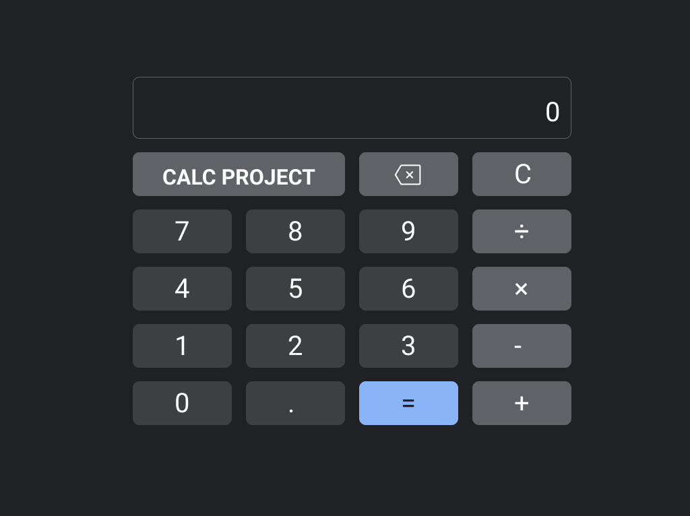

# CALCULATOR
:heavy_plus_sign: :heavy_minus_sign: :heavy_multiplication_x: :heavy_division_sign:

### DESCRIPTION

    This is a calculator project that counts with the four basic operations, but it also counts with a 'allClear' button and also a backspace button to give users the possibility to clean all the operations or just to erase some input error.

    Some other buttons like 'equals' and 'dot' buttons also are presented in this calculator. 

 

### Try this project clicking link below:
link: https://lincoln-araujo.github.io/brainnest-calculator/

    <strong>WHAT WAS THE HARDEST THING TO DO?</strong>  I had no idea how hard could be programming numbers more than one decimal place. I needed some help from the internet community to make this.

 

    To be honest, this project was really challenging. I was used to programming calc projects only in the backend and using 'console.log', but this was the first project I brought all this code to life through the front end.

 
